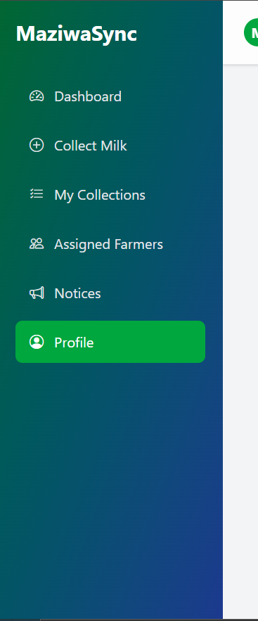
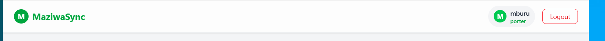
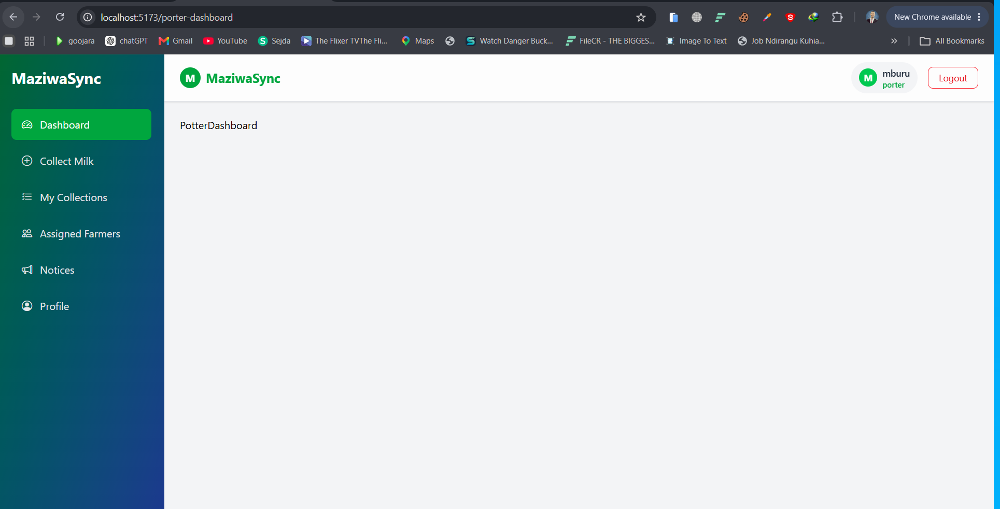
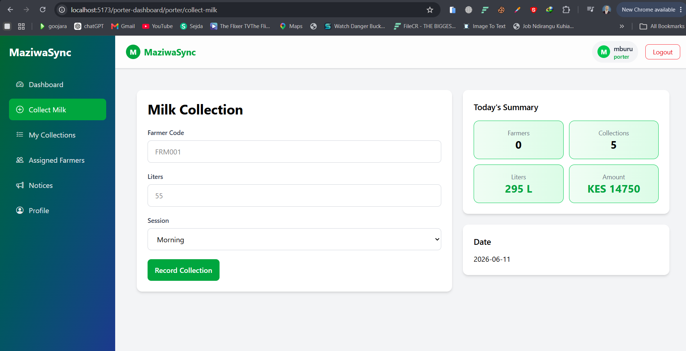

# MaziwaSync React Frontend

Frontend application for the Dairy Cooperative Management System built using React, Vite, Tailwind CSS, and Django REST Framework APIs.

---

# Technology Stack

## Frontend

* React
* Vite
* Tailwind CSS
* React Router DOM
* Axios
* Context API
* Bootstrap Icons

---

# Backend

* Django
* Django REST Framework
* JWT Authentication
* SQLite / PostgreSQL

---

# Learning Objectives

By the end of this project students should understand:

* React Components
* React Router
* Context API
* JWT Authentication
* Protected Routes
* Axios
* Tailwind CSS
* CRUD Operations
* API Consumption
* Dashboard Development
* Role-Based Access Control

---

# Step 1: Create React Project

Create the project using Vite.

```bash
npm create vite@latest MaziwaSyncReact
```

Select:

```text
Framework: React
Variant: JavaScript
```

Move into the project folder:

```bash
cd MaziwaSyncReact
```

Install dependencies:

```bash
npm install
```

---

# Step 2: Install Required Packages

## React Router

Used for page navigation.

```bash
npm install react-router-dom
```

---

## Axios

Used to consume Django REST APIs.

```bash
npm install axios
```

---

## JWT Decode

Used to decode JWT tokens and check expiration.

```bash
npm install jwt-decode
```

---

## Bootstrap Icons

Used for icons only.

```bash
npm install bootstrap-icons
```

---

# Step 3: Install Tailwind CSS

Install Tailwind CSS.

```bash
npm install tailwindcss @tailwindcss/vite
```

---

# Step 4: Configure Vite

Update:

```javascript
vite.config.js
```

```javascript
import { defineConfig } from 'vite'
import react from '@vitejs/plugin-react'
import tailwindcss from '@tailwindcss/vite'

export default defineConfig({
  plugins: [
    react(),
    tailwindcss(),
  ],
})
```

---

# Step 5: Configure CSS

Inside:

```css
src/index.css
```

Add:

```css
@import "tailwindcss";
```

---

# Step 6: Import Global Styles

Inside:

```javascript
src/main.jsx
```

```javascript
import './index.css'
import 'bootstrap-icons/font/bootstrap-icons.css'
```

---

# Step 7: Create Project Structure

```text
src
│
├── api
│   └── api.js
│
├── context
│   ├── AuthContext.jsx
│   └── ProtectedRoute.jsx
│
├── components
│
│   ├── auth
│   │   └── Login.jsx
│   │
│   ├── admin
│   │
│   ├── farmer
│   │
│   └── porter
│
├── App.jsx
└── main.jsx
```

---

# Development Flow

The project will be developed in the following order.

```text
Authentication
      ↓
Context API
      ↓
Protected Routes
      ↓
Porter Module
      ↓
Farmer Module
      ↓
Admin Module
```

---

# Module Development Order

## 1. Authentication

Build:

```text
Login.jsx
```

```jsx
import React, { useContext, useState } from "react";
import axios from "axios";
import api from "../../api/api";
import { AuthContext } from "../../context/AuthContext";
import { useNavigate } from "react-router-dom";

const Login = () => {
    const { setToken, setUser } = useContext(AuthContext);

    const [username, setUsername] = useState("");
    const [password, setPassword] = useState("");

    const [loading, setLoading] = useState(false);
    const [error, setError] = useState("");
    const [success, setSuccess] = useState("");
    const navigate = useNavigate()

    const handleLogin = async (e) => {
        e.preventDefault();

        setLoading(true);
        setError("");

        const data = {username,password};

        try {
            const res = await api.post("core/auth/login/", data);
            console.log("Login success:", res.data);

            // deconstruct
            const {access,refresh,username,role} = res.data;

            // Create user object
            const userData = { username, role};

            // Save to context
            setToken(access);
            setUser(userData);

            // Save to localStorage
            localStorage.setItem("access", access);
            localStorage.setItem("refresh", refresh);
            localStorage.setItem("user", JSON.stringify(userData));

            // ROLE-BASED REDIRECT
            if (role === "admin") {
                navigate("/admin-dashboard");
            } else if (role === "farmer") {
                navigate("/farmer-dashboard");
            } else if (role === "porter") {
                navigate("/porter-dashboard");
            } else {
                navigate("/not-authorized");
            }


        } catch (error) {
            setError(error.response?.data?.error || "Login failed");
        } finally {
            setLoading(false);
        }
    };

    return (
        <div className="min-h-screen flex items-center justify-center bg-gray-200">
            <form onSubmit={handleLogin} className="bg-white p-8 rounded-lg shadow-md w-full max-w-sm" >
                <h1 className="text-2xl font-bold text-center mb-6 text-green-600"> Login </h1>

                {/* SUCCESS MESSAGE */}
                {success && (<div className="mb-4 text-green-600 bg-green-100 p-2 rounded text-sm text-center"> {success}</div>)}

                {/* ERROR MESSAGE */}
                {error && (<div className="mb-4 text-red-600 bg-red-100 p-2 rounded text-sm text-center"> {error} </div>)}

                <input type="text" placeholder="Username" className="input-field mb-5" required
                    value={username}
                    onChange={(e) => setUsername(e.target.value)}
                />

                <input type="password" placeholder="Password" className="input-field mb-5" required
                    value={password}
                    onChange={(e) => setPassword(e.target.value)}
                />

                <button type="submit" disabled={loading}
                    className="w-full bg-green-600 text-white p-3 rounded hover:bg-green-700 disabled:opacity-50"
                >
                    {loading ? "Logging in..." : "Login"}
                </button>
            </form>
        </div>
    );
};

export default Login;
```
---
###  Axios Instance
```js
import axios from "axios";

// Create a reusable Axios instance.
// This prevents us from repeating the API URL in every request.
const api = axios.create({
    baseURL: "http://127.0.0.1:8000/api/",
    headers: {
        // Tell the backend that we are sending JSON data.
        "Content-Type": "application/json",
    },
});

// Interceptors run before every request.
// Here we automatically attach the JWT access token
// so protected endpoints can identify the logged-in user.
api.interceptors.request.use((config) => {

    // Get the token saved after login.
    const token = localStorage.getItem("access");

    // If a token exists, add it to the Authorization header.
    if (token) {
        config.headers.Authorization = `Bearer ${token}`;
    }

    // Always return the config so the request can continue.
    return config;
});

export default api;
```
Learn:

* Forms
* Axios POST
* JWT Authentication
* Local Storage
* Navigation

API:

```http
POST /api/login/
```

---

## 2. Context 

Build:

```text
AuthContext.jsx
```

```jsx
import { createContext, useCallback, useEffect, useState } from "react";
import { jwtDecode } from "jwt-decode";
import { useNavigate } from "react-router-dom";

// Create a global authentication context
// This allows us to access user + token anywhere in the app
export const AuthContext = createContext();

export const AuthProvider = ({ children }) => {
    const navigate = useNavigate();

    // -----------------------------
    // AUTH STATE (INITIAL LOAD)
    // -----------------------------

    // Load JWT token from localStorage so login persists on refresh
    const [token, setToken] = useState(
        () => localStorage.getItem("access") || ""
    );

    // Load user data from localStorage (if available)
    // We wrap JSON.parse in try/catch to avoid app crashes on invalid data
    const [user, setUser] = useState(() => {
        try {
            const stored = localStorage.getItem("user");
            return stored ? JSON.parse(stored) : null;
        } catch (err) {
            return null;
        }
    });

    // -----------------------------
    // LOGOUT FUNCTION
    // -----------------------------

    // Clears all authentication data and redirects user to login page
    const logout = useCallback(() => {
        localStorage.removeItem("access");
        localStorage.removeItem("refresh");
        localStorage.removeItem("user");

        setToken("");
        setUser(null);

        navigate("/login");
    }, [navigate]);

    // -----------------------------
    // TOKEN EXPIRY CHECK
    // -----------------------------

    // Runs every time token changes
    // Decodes JWT and checks if it is expired
    useEffect(() => {
        if (!token) return;

        try {
            const decoded = jwtDecode(token);

            // JWT "exp" is in seconds → convert to milliseconds
            const isExpired = decoded.exp * 1000 < Date.now();

            // If token is expired, force logout
            if (isExpired) {
                logout();
            }
        } catch (err) {
            // If token is invalid or corrupted → logout user
            logout();
        }
    }, [token, logout]);

    // -----------------------------
    // PROVIDER VALUE (GLOBAL STATE)
    // -----------------------------

    // Everything inside "value" becomes accessible in the app
    return (
        <AuthContext.Provider
            value={{
                token,      // JWT access token
                setToken,   // update token after login/refresh
                user,       // logged-in user data
                setUser,    // update user info
                logout,     // manual logout function
            }}
        >
            {children}
        </AuthContext.Provider>
    );
};
```

Responsibilities:

* Store token
* Store user
* Logout
* Check token expiration

Learn:

```text
createContext()
useState()
useEffect()
useCallback()
```

---

## 3. Protected Routes

Build:

```text
ProtectedRoute.jsx
```

```jsx
import { useContext } from "react";
import { AuthContext } from "./AuthContext";
import { Navigate } from "react-router-dom";

const ProtectedRoute = ({ children, allowedRoles }) => {
    const { user } = useContext(AuthContext);

    // Not logged in
    if (!user) {
        return <Navigate to="/login" />;
    }

    // Role check
    if (allowedRoles && !allowedRoles.includes(user.role)) {
        return <Navigate to="/not-authorized" />;
    }

    return children;
};

export default ProtectedRoute;
```

Responsibilities:

* Verify login
* Verify user role
* Redirect unauthorized users

Learn:

```text
Navigate
Role-Based Access Control
```

The app uses React Router v6 with role-based protected routes.

All routes are wrapped inside AuthProvider so authentication state is globally accessible.
---
Routing for the roles

```jsx
    <Router>
        {/* Wrap the entire application with AuthProvider
        so authentication state (user, token, logout)
        is available to all routes and protected pages */}
      <AuthProvider>

      <Routes>

        <Route path="/admin-dashboard"
          element={
              <ProtectedRoute allowedRoles={["admin"]}>
                  <AdminLayout />
              </ProtectedRoute>
          }/>

        <Route path="/farmer-dashboard"
          element={
              <ProtectedRoute allowedRoles={["farmer"]}>
                  {/* <FarmerDashboard /> */}
              </ProtectedRoute>
          }/>

        <Route path="/potter-dashboard"
          element={
              <ProtectedRoute allowedRoles={["potter"]}>
                <PorterLayout/>
              </ProtectedRoute>
          } />

        <Route path='/' element={<Home/>}/>
        <Route path='/login' element={<Login/>}/>
        <Route path='/not-authorized' element={<NotAuthorized/>}/>
        <Route path='*' element={<NotFound/>}/>
      </Routes>
    
      </AuthProvider>
    </Router>
```
---

# Porter Module

Build first because milk collection is the system's core business process.

Prepare the routing we will start with SideBar, DashboardNavBar, PotterLayout
```text
App Shell
│
├── Sidebar (navigation)
├── Navbar (top bar)
└── Main Content (Outlet)
```


## SideBar


```jsx

import { NavLink } from "react-router-dom";

const SideBar = ({ isOpen, setIsOpen }) => {
  const linkClass = ({ isActive }) =>
    `flex items-center gap-3 px-4 py-3 rounded-lg transition ${
      isActive
        ? "bg-green-600 text-white"
        : "text-gray-200 hover:bg-white/10"
    }`;

  return (
    <>
      {/* BACKDROP (mobile only) */}
      {isOpen && (
        <div
          onClick={() => setIsOpen(false)}
          className="fixed inset-0 bg-black/50 md:hidden z-40"
        />
      )}

      <aside
        className={`
          fixed md:static z-50
          top-0 left-0 h-full w-64
          bg-gradient-to-br from-green-800 to-blue-900 text-white
          transform transition-transform duration-300

          ${isOpen ? "translate-x-0" : "-translate-x-full md:translate-x-0"}
        `}
      >
        <div className="p-5">
          <h2 className="text-2xl font-bold mb-8">
            MaziwaSync
          </h2>

          <nav className="space-y-2">
            <NavLink to="/porter" end className={linkClass}>
              <i className="bi bi-speedometer2"></i>
              Dashboard
            </NavLink>

            <NavLink to="/porter/collect-milk" className={linkClass}>
              <i className="bi bi-plus-circle"></i>
              Collect Milk
            </NavLink>

            <NavLink to="/porter/collections" className={linkClass}>
              <i className="bi bi-list-check"></i>
              My Collections
            </NavLink>

            <NavLink to="/porter/farmers" className={linkClass}>
              <i className="bi bi-people"></i>
              Assigned Farmers
            </NavLink>

            <NavLink to="/porter/notices" className={linkClass}>
              <i className="bi bi-megaphone"></i>
              Notices
            </NavLink>

            <NavLink to="/porter/profile" className={linkClass}>
              <i className="bi bi-person-circle"></i>
              Profile
            </NavLink>
          </nav>
        </div>
      </aside>
    </>
  );
};

export default SideBar;
```

## DashboardNavBar 


```jsx
import React, { useContext } from "react";
import { AuthContext } from "../../context/AuthContext";

const DashboardNavBar = ({ onMenuClick }) => {
    const { user, logout } = useContext(AuthContext);

    return (
        <nav className="w-full bg-white/80 backdrop-blur-md shadow-sm border-b border-gray-200 px-4 md:px-6 py-3">

            <div className="flex items-center justify-between">

                {/* LEFT SIDE */}
                <div className="flex items-center gap-3">

                    {/* MOBILE MENU */}
                    <button
                        onClick={onMenuClick}
                        className="md:hidden text-2xl text-gray-700 active:scale-95 transition"
                    >
                        ☰
                    </button>

                    {/* BRAND */}
                    <div className="flex items-center gap-2">
                        <div className="w-8 h-8 rounded-full bg-green-600 flex items-center justify-center text-white font-bold">
                            M
                        </div>

                        <span className="text-lg md:text-xl font-bold text-green-600">
                            MaziwaSync
                        </span>
                    </div>
                </div>

                {/* RIGHT SIDE */}
                <div className="flex items-center gap-3 md:gap-4">

                    {/* USER CARD (hidden only on very small screens) */}
                    <div className="hidden sm:flex items-center gap-2 bg-gray-100 px-3 py-1.5 rounded-full">

                        <div className="w-7 h-7 rounded-full bg-green-500 text-white flex items-center justify-center text-sm font-bold">
                            {user?.username?.charAt(0).toUpperCase()}
                        </div>

                        <div className="flex flex-col leading-tight">
                            <span className="text-sm font-semibold text-gray-800">
                                {user?.username}
                            </span>

                            <span className="text-xs text-green-600 font-medium">
                                {user?.role}
                            </span>
                        </div>
                    </div>

                    {/* LOGOUT */}
                    <button
                        onClick={logout}
                        className="px-3 md:px-4 py-1.5 text-sm rounded-lg border border-red-500 text-red-600 hover:bg-red-500 hover:text-white transition active:scale-95"
                    >
                        Logout
                    </button>
                </div>
            </div>
        </nav>
    );
};

export default DashboardNavBar;
```

## PottersLayout
Overview


This layout controls:

Sidebar visibility
Navbar
Page rendering

```jsx
import React, { useState } from "react";
import SideBar from "./SideBar";
import { Outlet } from "react-router-dom";
import DashboardNavBar from "../layout/DashboardNavBar";

const PorterLayout = () => {
    const [isOpen, setIsOpen] = useState(false);

    return (
        <div className="flex h-screen overflow-hidden bg-gray-100">

            {/* SIDEBAR */}
            <SideBar isOpen={isOpen} setIsOpen={setIsOpen} />

            {/* MAIN AREA */}
            <div className="flex flex-col flex-1 h-full">

                {/* NAVBAR */}
                <DashboardNavBar onMenuClick={() => setIsOpen(true)} />

                {/* PAGE CONTENT */}
                <main className="flex-1 overflow-y-auto p-4 md:p-6">
                    <Outlet />
                </main>

            </div>
        </div>
    );
};

export default PorterLayout;
```

---

## Lesson 1: Add Milk Collection


API:

```http
POST /api/porters/milk-collections/add/
```
App.css
```css
@import "tailwindcss";

@layer components {

  .card {
    @apply bg-white rounded-xl shadow-md p-6;
  }

  .milk-input {
    @apply w-full px-4 py-3 border border-gray-300 rounded-lg
           outline-none transition
           focus:ring-2 focus:ring-green-500
           focus:border-green-500;
  }

  .form-label {
    @apply block mb-2 text-sm font-medium text-gray-700;
  }

  .milk-btn {
    @apply bg-green-600 text-white font-medium py-3 px-4 rounded-lg
           hover:bg-green-700 transition duration-200;
  }


  /* Stats */
  .stat-card {
  @apply border border-green-500 rounded-xl p-4 text-center bg-gradient-to-r from-green-50 to-green-100;  }

  .stat-label {
    @apply text-sm text-gray-500;
  }

  .stat-value {
    @apply text-2xl font-bold;
  }

  .stat-value-success {
    @apply text-2xl font-bold text-green-600;
  }

}
```
```text
components/porter/CollectMilk.jsx
```

```jsx
import React, { useState, useEffect } from "react";
import api from "../../api/api";
import { data } from "react-router-dom";

const CollectMilk = () => {
    const [farmerCode, setFarmerCode] = useState("");
    const [liters, setLiters] = useState("");
    const [session, setSession] = useState("MORNING");
    const [loading, setLoading] = useState(false);
    const [message, setMessage] = useState("");
    const [dashboard, setDashboard] = useState(null);

    
    const fetchDashboard = async () => {
        try {
            const { data } = await api.get("porters/dashboard/");
            setDashboard(data);
            console.log(data)
        } catch (err) {
            console.error(err);
        }
    };
    
    useEffect(() => { 
        fetchDashboard(); 
    }, []);

    const handleSubmit = async (e) => {
        e.preventDefault();
        setLoading(true);
        setMessage("");

        const data = {
            farmer_code: farmerCode,
            liters: Number(liters),
            session: session,
        };

        try {
            const res = await api.post("porters/milk-collections/add/", data);
            // console.log(res)
            setMessage(`${res?.data?.message} for ${res?.data?.farmer}.`);
            setFarmerCode("");
            setLiters("");
            setSession("MORNING");
            fetchDashboard();
        } catch (err) {
            // console.log(err)
            setMessage(err.response?.data?.message);
        } finally {
            setLoading(false);
        }

    };

    return (
    <div className="grid grid-cols-1 xl:grid-cols-5 gap-6 p-6">

        <div className="xl:col-span-3 card">
            <h2 className="text-3xl font-bold mb-6">Milk Collection</h2>
            {message && <div className="mt-5 p-3 rounded-lg bg-green-100 text-green-700">{message}</div>}


            <form onSubmit={handleSubmit} className="space-y-5">

                <div>
                    <label className="form-label">Farmer Code</label>
                    <input type="text" className="milk-input" placeholder="FRM001" 
                        value={farmerCode} 
                        onChange={(e) => setFarmerCode(e.target.value)} 
                        required />
                </div>

                <div>
                    <label className="form-label">Liters</label>
                    <input type="number" className="milk-input" placeholder="55" 
                        value={liters} 
                        onChange={(e) => setLiters(e.target.value)} 
                        required />
                </div>

                <div>
                    <label className="form-label">Session</label>
                    <select className="milk-input" value={session} onChange={(e) => setSession(e.target.value)}>
                        <option value="MORNING">Morning</option>
                        <option value="EVENING">Evening</option>
                    </select>
                </div>

                <button type="submit" disabled={loading} className="milk-btn">
                    {loading ? "Saving..." : "Record Collection"}
                </button>

            </form>

        </div>

        <div className="space-y-6 xl:col-span-2">

            <div className="card">
                <h3 className="text-lg font-semibold mb-4">Today's Summary</h3>

                <div className="grid grid-cols-2 gap-3">

                    <div className="stat-card">
                        <p className="stat-label">Farmers</p>
                        <p className="stat-value">{dashboard?.assigned_farmers}</p>
                    </div>

                    <div className="stat-card">
                        <p className="stat-label">Collections</p>
                        <p className="stat-value">{dashboard?.total_collections_today}</p>
                    </div>

                    <div className="stat-card">
                        <p className="stat-label">Liters</p>
                        <p className="stat-value-success">{dashboard?.total_liters_today} L</p>
                    </div>

                    <div className="stat-card">
                        <p className="stat-label">Amount</p>
                        <p className="stat-value-success">KES {dashboard?.total_amount_today}</p>
                    </div>

                </div>
            </div>

            <div className="card">
                <h3 className="text-lg font-semibold mb-3">Date</h3>
                <p>{dashboard?.date || "--"}</p>
            </div>

        </div>

    </div>

    );
};

export default CollectMilk;

```

Students learn:

* Forms
* POST requests
* JWT Authentication

---

## Lesson 2: My Collections

API:

```http
GET /api/porters/collections/my/
```

Component:

```text
components/porter/MyCollections.jsx
```
```jsx
import React, { useEffect, useState } from "react";
import api from "../../api/api";

const MyCollections = () => {
    const [collections, setCollections] = useState([]);
    const [loading, setLoading] = useState(true);

    const fetchCollections = async () => {
        try {
            const { data } = await api.get("porters/collections/my/");
            setCollections(data.results);
        } catch (err) {
            console.error(err);
        } finally {
            setLoading(false);
        }
    };

    useEffect(() => {
        fetchCollections();
    }, []);

    const totalLiters = collections.reduce(
        (sum, item) => sum + Number(item.liters),
        0
    );

    const totalAmount = collections.reduce(
        (sum, item) => sum + Number(item.total_amount),
        0
    );

    return (
        <div className="space-y-6 p-6">

            <div>
                <h1 className="text-3xl font-bold">My Collections</h1>
                <p className="text-gray-500">View your milk collection history.</p>
            </div>

            <div className="grid grid-cols-1 md:grid-cols-3 gap-4">

                <div className="stat-card">
                    <p className="stat-label">Collections</p>
                    <p className="stat-value">{collections.length}</p>
                </div>

                <div className="stat-card">
                    <p className="stat-label">Total Liters</p>
                    <p className="stat-value-success">{totalLiters} L</p>
                </div>

                <div className="stat-card">
                    <p className="stat-label">Total Earnings</p>
                    <p className="stat-value-success">KES {totalAmount}</p>
                </div>

            </div>

            <div className="card">

                <h2 className="text-xl font-semibold mb-4">Collection Records</h2>

                {loading ? (
                    <p>Loading collections...</p>
                ) : collections.length === 0 ? (
                    <p className="text-gray-500">No collections found.</p>
                ) : (
                    <div className="overflow-x-auto">

                        <table className="w-full p-5">

                            <thead className="bg-gradient-to-r from-green-100 to-green-300 p-5">
                                <tr className="border-b text-left p-5">
                                    <th className="py-3 pl-3">Date</th>
                                    <th className="py-3">Session</th>
                                    <th className="py-3">Liters</th>
                                    <th className="py-3">Rate</th>
                                    <th className="py-3">Amount</th>
                                </tr>
                            </thead>

                            <tbody>

                                {collections.map((item) => (
                                    <tr key={item.id} className="border-b hover:bg-green-50 pl-3">
                                        <td className="py-3">{item.collection_date}</td>
                                        <td className="py-3">
                                            <span className={`px-3 py-1 rounded-full text-xs font-medium ${item.session === "MORNING"
                                                    ? "bg-blue-100 text-blue-700"
                                                    : "bg-orange-100 text-orange-700"
                                                }`}>
                                                {item.session}
                                            </span>
                                        </td>
                                        <td className="py-3">{item.liters} L</td>
                                        <td className="py-3">KES {item.price_per_liter}</td>
                                        <td className="py-3 font-semibold text-green-600">KES {item.total_amount}</td>
                                    </tr>
                                ))}

                            </tbody>

                        </table>

                    </div>
                )}

            </div>

        </div>
    );
};

export default MyCollections;
```

Students learn:

* useEffect
* Axios GET
* Rendering lists

---

## Lesson 3: Porter Dashboard

Component:
API:
```http
GET /api/porters/dashboard/
```

```text
components/porter/PorterDashboard.jsx
```
```jsx
import React, { useEffect, useState } from "react";
import api from "../../api/api";

const PorterDashboard = () => {
    const [dashboard, setDashboard] = useState(null);
    const [loading, setLoading] = useState(true);
    const [error, setError] = useState("");

    // Fetch dashboard data when component mounts
    const fetchDashboard = async () => {
        try {
            const res = await api.get("porters/dashboard/");
            setDashboard(res.data);
        } catch (err) {
            setError("Failed to load dashboard");
        } finally {
            setLoading(false);
        }
    };

    useEffect(() => {
        fetchDashboard();
    }, []);

    // console.log(dashboard)
    if (loading) return <p className="p-6 text-gray-400">Loading dashboard...</p>;
    if (error) return <p className="p-6 text-red-500">{error}</p>;

    // destructuring
    const {
        assigned_farmers,
        total_collections_today,
        total_liters_today,
        total_amount_today,
        total_liters_week,
        total_liters_month,
        last_collections,
        porter_name,
        employee_id,
        route_name,
    } = dashboard;

    return (
        <div className="p-4 md:p-6 space-y-5 bg-gray-50 min-h-screen">

            {/* ── HEADER ── */}
            <div className="bg-white p-5 rounded-xl shadow-sm">
                <h1 className="text-2xl font-bold text-gray-800">Porter Dashboard</h1>
                <p className="text-gray-400 text-sm mt-1">
                    Welcome back, <span className="font-semibold text-gray-600">{porter_name}</span> 🚛
                </p>
            </div>

            {/* ── KPI CARDS ── each card has a colored top border to distinguish metrics */}
            <div className="grid grid-cols-1 sm:grid-cols-2 lg:grid-cols-4 gap-4">

                <div className="bg-white p-5 rounded-xl shadow-sm border-t-4 border-green-400 hover:shadow-md transition">
                    <p className="text-sm text-gray-400">Assigned Farmers</p>
                    <h2 className="text-2xl font-bold text-gray-800 mt-1">{assigned_farmers}</h2>
                    <i className="bi bi-people-fill text-green-400 text-2xl float-right -mt-8"></i>
                </div>

                <div className="bg-white p-5 rounded-xl shadow-sm border-t-4 border-blue-400 hover:shadow-md transition">
                    <p className="text-sm text-gray-400">Collections Today</p>
                    <h2 className="text-2xl font-bold text-gray-800 mt-1">{total_collections_today}</h2>
                    <i className="bi bi-journal-check text-blue-400 text-2xl float-right -mt-8"></i>
                </div>

                <div className="bg-white p-5 rounded-xl shadow-sm border-t-4 border-indigo-400 hover:shadow-md transition">
                    <p className="text-sm text-gray-400">Liters Today</p>
                    <h2 className="text-2xl font-bold text-gray-800 mt-1">{total_liters_today} L</h2>
                    <i className="bi bi-droplet-fill text-indigo-400 text-2xl float-right -mt-8"></i>
                </div>

                <div className="bg-white p-5 rounded-xl shadow-sm border-t-4 border-yellow-400 hover:shadow-md transition">
                    <p className="text-sm text-gray-400">Amount Today</p>
                    <h2 className="text-2xl font-bold text-gray-800 mt-1">KES {total_amount_today}</h2>
                    <i className="bi bi-cash-stack text-yellow-400 text-2xl float-right -mt-8"></i>
                </div>

            </div>

            {/* ── WEEKLY / MONTHLY ── */}
            <div className="grid grid-cols-1 md:grid-cols-2 gap-4">

                <div className="bg-white p-5 rounded-xl shadow-sm hover:shadow-md transition">
                    <p className="text-sm text-gray-400">Weekly Production</p>
                    <h2 className="text-xl font-bold text-green-600 mt-1">{total_liters_week} L</h2>
                </div>

                <div className="bg-white p-5 rounded-xl shadow-sm hover:shadow-md transition">
                    <p className="text-sm text-gray-400">Monthly Production</p>
                    <h2 className="text-xl font-bold text-blue-600 mt-1">{total_liters_month} L</h2>
                </div>

            </div>

            {/* ── LAST 5 COLLECTIONS ── */}
            <div className="bg-white rounded-xl shadow-sm overflow-hidden">

                <div className="p-4 border-b border-gray-100">
                    <h3 className="font-semibold text-gray-700">Last 5 Collections</h3>
                </div>

                {/* Desktop table */}
                <div className="hidden md:block overflow-x-auto">
                    <table className="w-full text-sm">
                        <thead className="bg-gray-50 text-gray-400 text-xs uppercase">
                            <tr>
                                <th className="p-3 text-left">Farmer</th>
                                <th className="p-3 text-left">Liters</th>
                                <th className="p-3 text-left">Session</th>
                                <th className="p-3 text-left">Date</th>
                                <th className="p-3 text-left">Amount</th>
                            </tr>
                        </thead>
                        <tbody>
                            {last_collections.map((c) => (
                                <tr key={c.id} className="border-t border-gray-100 hover:bg-gray-50">
                                    <td className="p-3 capitalize">{c.farmer_name}</td>
                                    <td className="p-3">{c.liters} L</td>
                                    <td className="p-3">{c.session}</td>
                                    <td className="p-3 text-gray-400">{c.collection_date}</td>
                                    <td className="p-3 font-semibold text-green-600">KES {c.total_amount}</td>
                                </tr>
                            ))}
                        </tbody>
                    </table>
                </div>

                {/* Mobile cards */}
                <div className="md:hidden space-y-2 p-3">
                    {last_collections.map((c) => (
                        <div key={c.id} className="bg-gray-50 rounded-lg p-3">
                            <p className="font-semibold text-gray-700 capitalize">{c.farmer_name}</p>
                            <p className="text-sm text-gray-500">{c.liters} L • {c.session}</p>
                            <p className="text-xs text-gray-400">{c.collection_date}</p>
                            <p className="text-green-600 font-semibold text-sm">KES {c.total_amount}</p>
                        </div>
                    ))}
                </div>

            </div>

            {/* ── PORTER INFO ── */}
            <div className="grid grid-cols-1 sm:grid-cols-3 gap-4">

                <div className="bg-white p-4 rounded-xl shadow-sm text-center">
                    <p className="text-xs text-gray-400 uppercase tracking-wide">Employee</p>
                    <p className="font-semibold text-gray-700 mt-1">{porter_name}</p>
                </div>

                <div className="bg-white p-4 rounded-xl shadow-sm text-center">
                    <p className="text-xs text-gray-400 uppercase tracking-wide">Employee ID</p>
                    <p className="font-semibold text-gray-700 mt-1">{employee_id}</p>
                </div>

                <div className="bg-white p-4 rounded-xl shadow-sm text-center">
                    <p className="text-xs text-gray-400 uppercase tracking-wide">Route</p>
                    <p className="font-semibold text-gray-700 mt-1">{route_name}</p>
                </div>

            </div>

        </div>
    );
};

export default PorterDashboard;
```


Students learn:

* Dashboard Cards
* Statistics
* API Consumption

---

## Lesson 4: Notices

Component:

API:

```http
GET /api/notices/
```

```text
components/porter/PorterNotices.jsx
```

```jsx
import React, { useEffect, useState } from "react";
import api from "../../api/api";

const Notices = () => {
    const [notices, setNotices] = useState([]);
    const [loading, setLoading] = useState(true);
    const [error, setError] = useState("");

    
    const fetchNotices = async () => {
        try {
            const res = await api.get("porters/notices/");
            setNotices(res.data);
        } catch (err) {
            setError("Failed to load notices.");
        } finally {
            setLoading(false);
        }
    };
    
    useEffect(() => {
        fetchNotices();
    }, []);
    
    if (loading) {return (<div className="p-6"> <p className="text-gray-500">Loading notices...</p></div>);}

    if (error) { return (<div className="p-6"> <p className="text-red-500">{error}</p>  </div>); }

    return (
        <div className="p-4 md:p-6">

            {/* PAGE HEADER */}
            <div className="mb-6">
                <h1 className="text-2xl font-bold text-gray-800">Notices</h1>
                <p className="text-gray-500"> Important updates and announcements. </p>
            </div>

            {notices.length === 0 ? (
                <div className="bg-white rounded-xl shadow p-6 text-center">
                    <i className="bi bi-bell text-4xl text-gray-300"></i>
                    <p className="mt-3 text-gray-500">
                        No notices available.
                    </p>
                </div>
            ) : (
                <div className="space-y-4">
                    {notices.map((notice) => (
                        <div
                            key={notice.id}
                            className={`bg-white rounded-xl shadow-sm border-l-4 p-5 transition hover:shadow-md ${
                                notice.is_important
                                    ? "border-red-500"
                                    : "border-green-500"
                            }`}
                        >
                            <div className="flex flex-col md:flex-row md:items-center md:justify-between gap-2">

                                <div className="flex items-center gap-2">
                                    <h3 className="text-lg font-semibold text-gray-800">{notice.title}</h3>

                                    {notice.is_important && (
                                        <span className="bg-red-100 text-red-600 text-xs px-2 py-1 rounded-full font-medium">
                                            Important
                                        </span>
                                    )}
                                </div>

                                <span className="text-sm text-gray-500">
                                    {new Date( notice.created_at).toLocaleDateString()}
                                </span>
                            </div>
                            <p className="mt-3 text-gray-600"> {notice.message}</p>
                            <div className="mt-4 flex items-center gap-2">
                                <span className="text-xs bg-gray-100 text-gray-600 px-3 py-1 rounded-full">
                                    {notice.target}
                                </span>
                            </div>
                        </div>
                    ))}
                </div>
            )}
        </div>
    );
};

export default Notices;
```


potter/AssignedFarmers.jsx

```jsx
import React from 'react'

const AssignedFarmers = () => {
  return (
    <div>AssignedFarmers</div>
  )
}

export default AssignedFarmers
```

---

# Farmer Module

---

## Lesson 1: View Collections

Component:

```text
components/farmer/FarmerCollections.jsx
```

API:

```http
GET /api/farmers/collections/
```

---

## Lesson 2: Feedback CRUD

Component:

```text
components/farmer/Feedback.jsx
```

API:

```http
/api/farmers/feedback/
```

Students learn:

* Create
* Read
* Update
* Delete

---

## Lesson 3: Farmer Dashboard

Component:

```text
components/farmer/FarmerDashboard.jsx
```

API:

```http
GET /api/farmers/dashboard/
```

---

## Lesson 4: Notices

Component:

```text
components/farmer/FarmerNotices.jsx
```

API:

```http
GET /api/notices/
```

---

# Admin Module

Build last because it consumes information produced by farmers and porters.

---

## Lesson 1: Manage Farmers

```text
components/admin/Farmers.jsx
```

---

## Lesson 2: Manage Porters

```text
components/admin/Porters.jsx
```

---

## Lesson 3: Manage Collections

```text
components/admin/Collections.jsx
```

---

## Lesson 4: Manage Notices

```text
components/admin/Notices.jsx
```

---

## Lesson 5: Admin Dashboard

```text
components/admin/AdminDashboard.jsx
```

API:

```http
GET /api/admin/dashboard/
```

Students learn:

* Analytics
* Reporting
* Business Dashboards

---

# Final Learning Flow

```text
React Setup
    ↓
Tailwind CSS
    ↓
Authentication
    ↓
Context API
    ↓
Protected Routes
    ↓
Porter Module
    ↓
Farmer Module
    ↓
Admin Module
```

This sequence follows the real business workflow of the dairy cooperative and is the easiest path for students to understand and implement.
